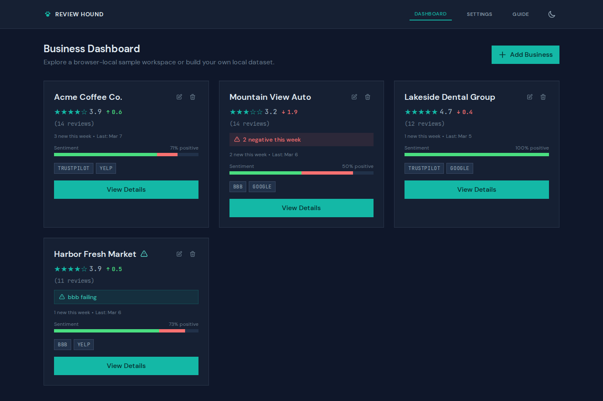
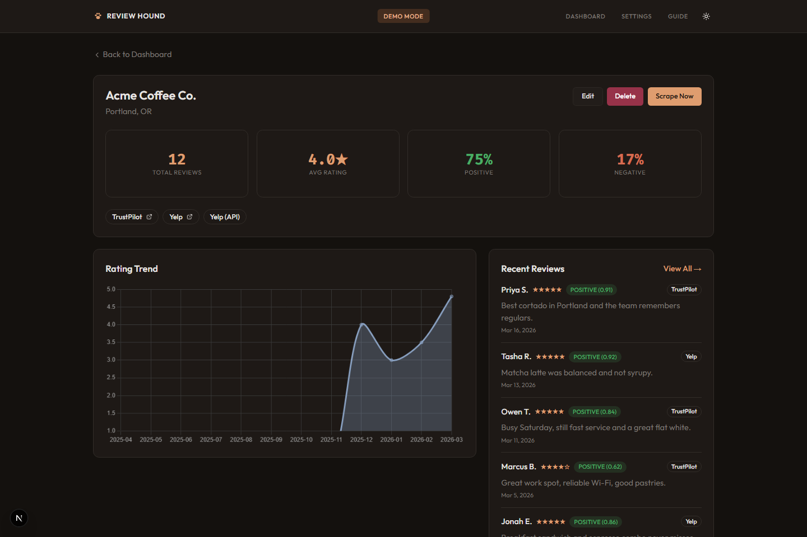
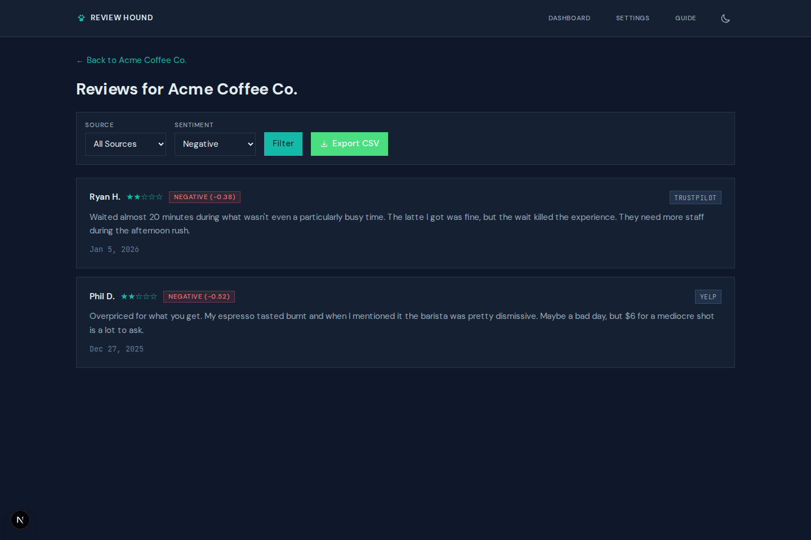
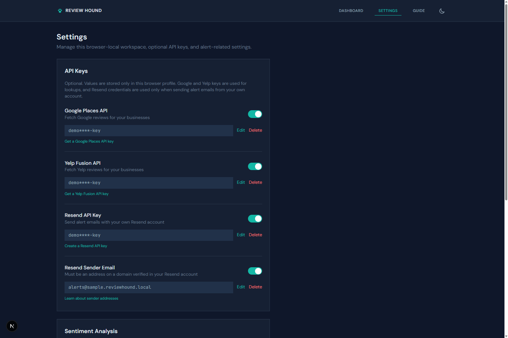

# 🐕 Review Hound

[](https://pypi.org/project/reviewhound/)
[](https://github.com/jonmartin721/review-hound/actions)
[](https://www.python.org)
[](LICENSE)
[](https://codecov.io/gh/jonmartin721/review-hound)

<p align="center">
  <video src="https://github.com/jonmartin721/review-hound/raw/main/assets/hero-dark.mp4" autoplay loop muted playsinline width="720"></video>
</p>

Stop checking review sites one by one. Review Hound pulls from TrustPilot, BBB, Yelp, Google Places, and the Yelp Fusion API—flags negative reviews and emails you before customers start talking.

**Why?** Bad reviews spread. A 1-star complaint can sit for days before you notice. Review Hound catches them within hours.

## Features

- **Five review sources**: Scrape TrustPilot, BBB, and Yelp pages, or pull via Google Places and Yelp Fusion APIs
- **Source search**: Find business pages on TrustPilot and BBB directly from the web UI
- **Sentiment scoring**: Flags negative reviews automatically so you know what needs attention
- **Web dashboard**: Next.js frontend with per-business stats, rating trends, and scrape controls
- **Email alerts**: Get notified via SMTP or the Resend API when someone leaves a bad review
- **Encrypted API keys**: API credentials are encrypted at rest with Fernet symmetric encryption
- **CLI or web**: Use whichever fits your workflow
- **Scheduled scraping**: Set it and forget it—runs every few hours
- **CSV export**: Pull data out for spreadsheets or reporting

## Screenshots

### Dashboard
Track all your businesses at a glance with ratings, sentiment breakdowns, and source health indicators.



### Business Detail
See per-business stats, rating trends, recent reviews, and scrape controls in one place.



### Reviews
Browse and filter reviews by source and sentiment, with CSV export support.



### Settings
Configure Google Places, Yelp Fusion, and optional Resend credentials, plus sentiment analysis tuning.



## Quick Start

### Install from PyPI

```bash
pip install reviewhound
```

That's it. Now run the web dashboard:

```bash
reviewhound web
# → Starting web dashboard at http://127.0.0.1:5000
```

Or use the CLI directly:

```bash
reviewhound add "Acme Corp" --trustpilot "https://trustpilot.com/review/acme.com"
reviewhound scrape --all
reviewhound list
```

### Using Docker

```bash
git clone https://github.com/jonmartin721/review-hound.git
cd review-hound
docker-compose up -d
# → Access at http://localhost:5000
```

### From Source

```bash
git clone https://github.com/jonmartin721/review-hound.git
cd review-hound
pip install -e .
reviewhound web
```

## CLI Usage

### Add a Business

```bash
# Add with TrustPilot URL
reviewhound add "Acme Corp" --trustpilot "https://www.trustpilot.com/review/acme.com"

# Add with multiple sources
reviewhound add "Acme Corp" \
  --trustpilot "https://www.trustpilot.com/review/acme.com" \
  --bbb "https://www.bbb.org/..." \
  --yelp "https://www.yelp.com/biz/acme-corp"
```

### Scrape Reviews

```bash
# Scrape one business
reviewhound scrape "Acme"
# → Scraped 47 reviews from 3 sources

# Scrape everything (grab coffee, this takes a minute)
reviewhound scrape --all
# → Scraped 203 reviews across 5 businesses
```

### View Reviews

```bash
# List all businesses
reviewhound list

# View reviews for a business
reviewhound reviews 1 --limit 50

# Filter by sentiment
reviewhound reviews 1 --sentiment negative

# View statistics
reviewhound stats 1
```

### Export Data

```bash
# Export to CSV
reviewhound export 1 -o acme_reviews.csv
```

### Email Alerts

```bash
# Configure alerts for negative reviews
reviewhound alert 1 alerts@company.com --threshold 3.0

# List alert configurations
reviewhound alerts
```

### Scheduled Scraping

```bash
# Run scheduler (scrapes every 6 hours by default)
reviewhound watch

# Custom interval
reviewhound watch --interval 2

# Run web dashboard with scheduler
reviewhound web --with-scheduler
```

## Configuration

Create a `.env` file in the project root:

```env
# Database
DATABASE_PATH=data/reviews.db

# Scraping
REQUEST_DELAY_MIN=2.0
REQUEST_DELAY_MAX=4.0
MAX_PAGES_PER_SOURCE=3

# Scheduler
SCRAPE_INTERVAL_HOURS=6

# Email Alerts (optional — SMTP)
SMTP_HOST=smtp.gmail.com
SMTP_PORT=587
SMTP_USER=your-email@gmail.com
SMTP_PASSWORD=your-app-password
SMTP_FROM=alerts@yourdomain.com

# Encryption (optional — auto-generated if not set)
ENCRYPTION_KEY=

# Web Dashboard
FLASK_SECRET_KEY=change-this-in-production
FLASK_DEBUG=false
```

Google Places, Yelp Fusion, and Resend API keys are managed through the Settings page in the web UI and stored encrypted—they don't go in `.env`.

## Web Dashboard

There are two web UIs depending on how you run Review Hound:

**Next.js app** — the hosted frontend at [review-hound.vercel.app](https://review-hound.vercel.app/) and what you get when developing locally with `npm run dev` in `frontend/`. Built with React 19, shadcn/ui, Tailwind, and Chart.js.

**Flask UI** — bundled with the CLI. Run `reviewhound web` and open `http://localhost:5000`. Server-rendered with Jinja2 templates, no build step required.

Both provide:

- **Dashboard**: Overview of all businesses with sentiment bars and ratings
- **Business Detail**: Per-business stats, rating trends, and recent reviews
- **Reviews Page**: Filterable list of all reviews with CSV export
- **One-Click Scraping**: Trigger scrapes directly from the UI
- **Settings**: Manage API keys, configure sentiment thresholds

## Public Demo

**[Try it live →](https://review-hound.vercel.app/)**

The public web deployment is a limited browser-local demo of Review Hound, not the full product.

### Demo Includes

- Sample data plus an option to switch to an empty browser-local workspace
- Browser storage for businesses, reviews, scrape logs, alert rules, API keys, and sentiment settings
- TrustPilot and BBB source search
- On-demand scraping from the web UI
- Review filtering, charts, and CSV export
- Google Places and Yelp lookups with user-supplied API keys
- Email alerts with user-supplied Resend credentials and sender address
- Automatic checks while the browser tab is open

### Demo Limits

- No server-side persistent workspace storage
- No always-on background monitoring when the browser tab is closed
- No CLI workflows
- No Docker or self-hosted runtime controls
- No built-in server-managed email delivery

Clone or fork the repo for the full self-hosted app:

- GitHub: https://github.com/jonmartin721/review-hound

## Project Structure

```
review-hound/
├── reviewhound/           # Python backend
│   ├── scrapers/          # TrustPilot, BBB, Yelp, Google Places, Yelp Fusion
│   ├── analysis/          # Sentiment scoring
│   ├── alerts/            # SMTP + Resend email alerts
│   └── web/               # Flask UI
├── frontend/              # Next.js web app
├── api/                   # Vercel serverless functions
├── tests/
├── Dockerfile
└── docker-compose.yml
```

## Development

### Backend

```bash
git clone https://github.com/jonmartin721/review-hound.git
cd review-hound
pip install -e ".[dev]"

# Run tests
pytest tests/ -v

# Run Flask UI in debug mode
reviewhound web --debug
```

### Frontend

```bash
cd frontend
npm install

# Start dev server (http://localhost:3000)
npm run dev

# Run tests
npx vitest
npx playwright test
```

## What's Next?

- Set up email alerts: `reviewhound alert 1 you@email.com`
- Run the scheduler for hands-off monitoring: `reviewhound watch`
- Found a bug? [Open an issue](https://github.com/jonmartin721/review-hound/issues)

## Disclaimer

Web scraping may violate some websites' Terms of Service. Use responsibly and respect rate limits.

## License

MIT License - see LICENSE file for details.
